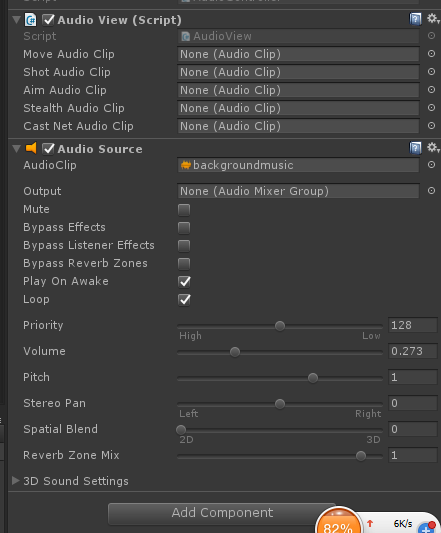

## 
DEMO中第一版音效替换说明 
##

###音频文件位置###
Unity3D中的音效文件放入Unity3D中的Assets/Audios文件夹中，新增加的音效文件请放入该文件夹进行测试。在Assets/Audios文件夹下默认的音频文件有：

- move.mp3（移动）
- shot.mp3（射击）
- aim.mp3(瞄准)
- background.mp3（主场景背景音乐）
- stealth.mp3（潜行）

后续版本可能需要：

- castnet.mp3（撒网）
- loginbgm.mp3（登录场景背景乐）
- selectbgm.mp3（选人场景背景乐）
- victory.mp3（胜利）
- lose.mp3（失败）

###音乐文件格式###

音乐格式支持wav和mp3，长时间播放的音乐，如BGM，最好使用mp3格式存储

###**如何修改绑定**###

DEMO中的音效文件都是绑定在场景中的Game->AudioManager中，如图：

选中这个AudioManager之后，在右侧的Inspector中，可以看到面板中缺失的音乐组件，如下图所示：

接下来只需要分别将改好的音乐（放在Assets/Audios文件夹中）拖入缺失的地方就可以了。

###音频BUG说明和反馈###

