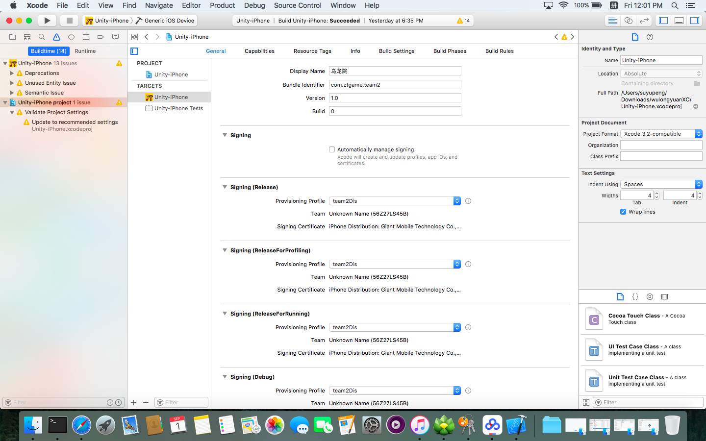
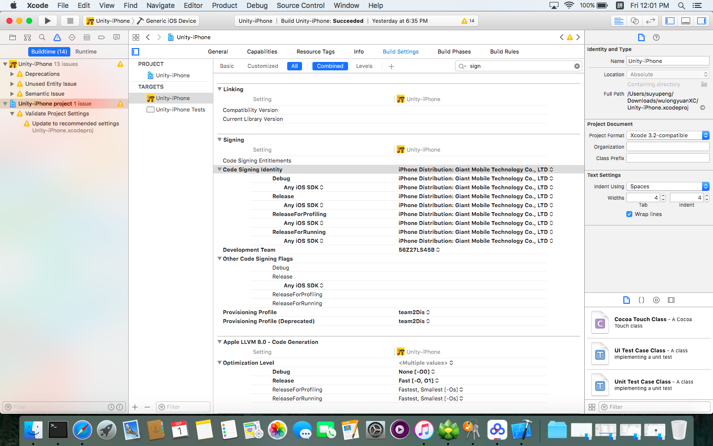
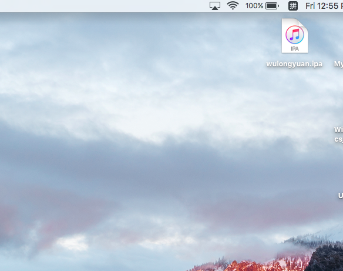
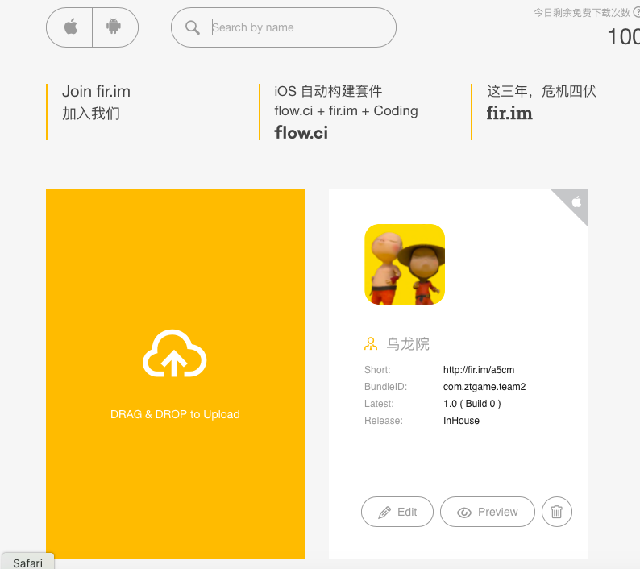

## 
Unity的Demo程序在Mac上打ipa包并第三方平台免费发布
##

###问题概述###
我们Demo小组的策划想要让我们的Demo运行在其他的iOS机型上，但之前通过Mac的Xcode一个个连接手机下载安装程序的方式太慢太死板，所以有必要打包成ipa的包，发布在第三平台上供其他手机下载，一来可以加快下载速度，不用一个个通过数据线连接Mac进行下载，二来，学习一下打包技术，提升自己的技能。

###思路###
- 使用公司提供的企业证书，在Mac的Xcode上对Unity导出的Demo工程进行编译并导出ipa包
- 出于经济条件和审核的方便性，可以优先在第三方平台 [fir（点我预览）](http://fir.im)上传自己的ipa，虽然下载次数有限，但提高了初期的测试速度。

###准备工作###
- 使用Unity3D对Demo程序进行Build，得到可以在Mac下执行编译下载的Xcode工程。
- 在Mac中导入公司给予的测试用p12证书

###开始打包###
**1.在Xcode中配置证书**

&emsp;&emsp;首先将自动管理签名关闭，然后使用teamxDis的签名，如下图所示：

&emsp;&emsp;
&emsp;&emsp;然后在Build Settings里添加签名，可以直接在搜索框输入 “sign” 关键字快速定位，如下图所示：

**2.使用命令行打包**
 
&emsp;&emsp; 配置完成后，就可以在Terminal中进入到你导出的Xcode项目中，运行如下命令进行打包相关工作：

（0）进入工程目录

命令行进入你们的Xcode项目目录中,这里以我们的Demo项目wulongyuan为例：

<code>
cd /xxxxxxx
</code>

（1）清除命令

<code>
xcodebuild clean    
</code>

出现clean succeed 表示清理成功~

（2）编译命令

<code>
xcodebuild -target wulongyuan -configuration Release  
</code>

出现build succeed 表示编译成功~

（3）打包命令

<code>
xcrun -sdk iphoneos  PackageApplication -v ./build/Release-iphoneos/wulongyuan.app -o /Users/suyupeng/Desktop/wulongyuan.ipa
</code>

成功后，会在你的桌面上出现你们工程的ipa文件，如下图所示：

（4）上传至fir

如图所示：可以在fir.im网站中注册，实名认证后获得每天100次下载机会，然后将桌面的ipa文件拖到如下图所示的网页中，等待上传完成就可以了

手机如何下载上传后的应用呢？很简单，只要点击上图中的Perview，会弹出一个新网页，里面有应用的二维码连接，手机扫描即可下载~

###遇到的问题索引###
- 直接使用Mac上的Xcode进行IPA打包，会出现“To save for iOS App Store Deployment, you need to add an Apple ID account that is enrolled in the iOS Developer Program for the development team xxxxxxx” 的提示，这个问题会导致直接使用Xcode打IPA包无法进行，但是通过命令行可以打包，因此，推荐使用上述的命令行打包方式。

###致谢###
感谢技术部牟广义老师的指导，感谢其他技术小伙伴儿提供思路。

